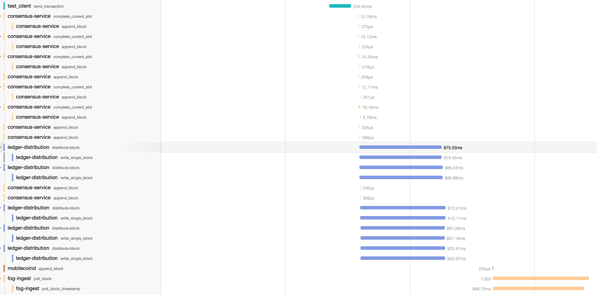

- Feature Name: `block_streaming`
- Start Date: 2022-03-01
- MCIP PR:
  [mcips #29](https://github.com/mobilecoinfoundation/mcips/pull/29)
- Tracking Issue:
  [mobilecoin #1433](https://github.com/mobilecoinfoundation/mobilecoin/issues/1433)


## Contents
- [Summary](#summary)
- [Motivation](#motivation)
- [Guide-level explanation](#guide-level-explanation)
- [Reference-level explanation](#reference-level-explanation)
  - [Streaming API](#streaming-api)
    - [Fanout network layout](#fanout-network-layout)
  - [Backfill API](#backfill-api)
    - [Paths for archived blocks](#paths-for-archived-blocks)
- [Drawbacks](#drawbacks)
- [Rationale and alternatives](#rationale-and-alternatives)
- [Prior art](#prior-art)
- [Unresolved questions](#unresolved-questions)
- [Future possibilities](#future-possibilities)
  - [Publish/Subscribe mechanisms](#publishsubscribe-mechanisms)

# Summary
[summary]: #summary

This MCIP formalizes the API for getting blocks from consensus nodes.

This includes defining an API for streaming blocks using a dedicated fanout
mechanism, rather than repeatedly polling S3 for new blocks.

# Motivation
[motivation]: #motivation

About 40% of the end-to-end transaction time is spent writing to and reading
from S3. This can be optimized using a dedicated
[publish/subscribe](https://en.wikipedia.org/wiki/Publish%E2%80%93subscribe_pattern)
mechanism to distribute updates across nodes.

<details>
<summary>Details on the 40% figure</summary>

As shown in the screenshot below (dated 2021-11-17), of the 5 seconds to
externalize a transaction, we spent almost one second uploading to S3, and
another second downloading from S3.


</details>

By using purpose-built pub/sub block streaming, we will no longer need to poll
S3 on regular intervals, and the block download times will greatly decrease.

# Guide-level explanation
[guide-level-explanation]: #guide-level-explanation

This is a backend implementation change that should be transparent to everyone
else.

When a node starts up, it will subscribe to updates from its peer consensus
nodes, and request (or be configured with) the base URL for fetching archived
blocks, and fetch those in parallel.

# Reference-level explanation
[reference-level-explanation]: #reference-level-explanation

There will be two mechanisms for getting blocks from consensus nodes:
1. A streaming API for getting the latest blocks, and
2. A backfill/discovery API specifying where to find archived blocks.

Each consensus node's ledger is distributed via a local "side-car" process,
`ledger-distribution`, to an associated directory in S3
(`ledger.mainnet.mobilecoin.com` bucket for MainNet, `mobilecoin.chain` bucket
for TestNet).

The other nodes then download these blocks from S3, usually via the
[`ledger-sync` crate](https://github.com/mobilecoinfoundation/mobilecoin/tree/master/ledger/sync).
Some other services, such as Fog, use
[`mobilecoind`](https://github.com/mobilecoinfoundation/mobilecoin/tree/master/mobilecoind)
to sync blocks, and wallets such as
[`full-service`](https://github.com/mobilecoinofficial/full-service) also
implement the syncing functionality.

This MCIP expands the distribution to also publish to a message bus, and expands
the `TransactionsFetcher` idiom to support receiving updates from this message
bus.

When a node needs to get blocks and has not received them via the message bus,
it will fall back to fetching the node from S3, matching existing behaviour.

## Streaming API
This is the entrypoint for subscribing to block updates, leveraging
[server streaming gRPC](https://grpc.io/docs/what-is-grpc/core-concepts/#server-streaming-rpc).

The Streaming API will look like the following:

```proto3
message SubscribeRequest {
    /// Block index to start from.
    uint64 starting_height = 1;
}

service LedgerUpdates {
    rpc Subscribe(SubscribeRequest) returns (stream ArchiveBlock);
}
```

### Fanout network layout
This MCIP intentionally avoids prescribing a particular layout for the fanout
network, in part because various operators have unique constraints, but also
because it is affected by other implementation decisions that are yet to be
determined, and can be changed without affecting the rest of this proposal.

With that said, we outline some possible approaches below.

#### Serve from consensus node
Add the `LedgerUpdates` gRPC server to the consensus node binary.

Pros:
* Simple setup.

Cons:
* Mixes [concerns](https://en.wikipedia.org/wiki/Separation_of_concerns).
* The consensus node is now serving additional gRPC traffic, which may very well
  make the node easier to overload, potentially leading to a DDoS.
* Negates the benefit of having a separate `ledger-distribution` binary.

#### Message bus per cluster
Set up a message bus per cluster of nodes (e.g. a data center or availability
zone), similar to how one might have a shared cache instance.

Pros:
* Maintains decentralization.
* Matches network topology.
* May unlock scaling benefits of dedicated brokers for the fanout network.

Cons:
* One more service to host and operate.

#### Shared message bus
Extending the previous option, we could offer a shared bus hosted by the
MobileCoin Foundation.

Pros:
* Lower burden on other node operators.
* Potentially lower barrier to entry for operating a consensus node.

Cons:
* Introduces a centralized service.
* Additional load and cost for MCF, with an unclear growth profile.

## Backfill API
The Backfill API will look like the following:

```proto3
message ArchiveBlocksUrlRequest {
    // May include hints for geographic proximity and/or caching.
}

message ArchiveBlocksUrlResponse {
    string base_url = 1;
}

service ArchiveBlocks {
    rpc GetBaseUrl(ArchiveBlocksUrlRequest) returns (ArchiveBlocksUrlResponse);
}
```

Clients will then download the serialized block protobuf from the returned URL.

Note that this builds on [MCIP #43](0043-block-metadata.md), which adds `BlockMetadata` to `ArchiveBlock`.

### Paths for archived blocks

#### Single Blocks
The block-specific path is a function of the block index. The file name is the
hexadecimal representation of the index, padded to 16 hexadecimal characters.
The index-as-file-name is repeated in the directory path.

For example:
* block with index `1` will be at
  `$BASE/00/00/00/00/00/00/00/0000000000000001.pb`,
* block with index `0x1a2b_3c4e_5a6b_7c8d` will be at
  `$BASE/1a/2b/3c/4e/5a/6b/7c/1a2b3c4e5a6b7c8d.pb`

See
[`block_num_to_s3block_path`](https://github.com/mobilecoinfoundation/mobilecoin/search?q=fn.block_num_to_s3block_path)
for an implementation of this logic.

#### Merged Blocks
We also support merged blocks to reduce the number of file operations. The
merged block path is similar, with a prefix directory `merged-$N` where `N > 1`
is the bucket size, and the index is that of the starting block (also a multiple
of `N`).

`ledger-distribution` will default to merging into buckets of 100, 1000 and
10000 blocks.

For example:
* merged blocks with `N=10` and starting index `0` will be at
  `$BASE/merged-10/00/00/00/00/00/00/00/0000000000000000.pb`,
* merged blocks with `N=1000` and starting index `1_000_000_000_000_000` will be
  at `$BASE/merged-1000/00/03/8d/7e/a4/c6/80/00038d7ea4c68000.pb`

See
[`merged_block_num_to_s3block_path`](https://github.com/mobilecoinfoundation/mobilecoin/search?q=fn.merged_block_num_to_s3block_path)
for an implementation of this logic.


# Drawbacks
[drawbacks]: #drawbacks

The primary drawback is introducing a dependency on another subsystem, namely
the message bus, which may affect our uptime or/and throughput.

With that said, this is an additive change, since we will fall back to S3 if no
messages arrive, so the behaviour and performance in the worst-case scenario
matches the existing system.

# Rationale and alternatives
[rationale-and-alternatives]: #rationale-and-alternatives

The main constraints for the fanout mechanism are performance, maintaining
decentralization (i.e. not introducing a centralized service), and interfacing
across nodes run by separate operators. Given that, we have opted for a custom
API.

We shall start with one publisher per consensus node, for maximum flexibility.
These nodes can be merged/shared per operator cluster, without loss of
generality.

One alternative is to have the MobileCoin Foundation run a pub/sub service, but
that introduces a centralized service that can become a single point of failure.

The authors have found no other alternative that satisfies our constraints.

The impact of not doing this is what we currently have, which wastes precious
time doing S3 I/O, effectively using it as a message bus, for which it was
simply not designed

# Prior art
[prior-art]: #prior-art

* [Streamr Network is a decentralized pub/sub network](https://medium.com/streamrblog/building-the-missing-protocol-of-todays-internet-stack-a-decentralized-pub-sub-network-for-ad1f5972f3ca)
* [Ethereum has Whisper](https://eth.wiki/concepts/whisper/whisper)
* [IPFS also has a pubsub implementation](https://blog.ipfs.io/25-pubsub/)

# Unresolved questions
[unresolved-questions]: #unresolved-questions

We will need to experiment with different pub/sub implementations, and may
switch implementations as needed. See [publish-subscribe-mechanisms] below.

# Future possibilities
[future-possibilities]: #future-possibilities

While this MCIP focuses on distributing blocks from consensus nodes, the same
concepts can be useful for Fog and other subsystems.

## Publish/Subscribe mechanisms
[publish-subscribe-mechanisms]: #publishsubscribe-mechanisms

This section outlines some possible implementations backing the public API.

#### Kafka
[Apache Kafka](https://kafka.apache.org/) is a mature offering. Quoting
[Confluent](https://www.confluent.io/what-is-apache-kafka):

> Apache Kafka is a community distributed event streaming platform capable of
> handling trillions of events a day. Initially conceived as a messaging queue,
> Kafka is based on an abstraction of a distributed commit log. Since being
> created and open sourced by LinkedIn in 2011, Kafka has quickly evolved from
> messaging queue to a full-fledged event streaming platform.

Pros:
* Kafka is an established message bus, with a fair bit of established experience
  hosting and operating instances, including many cloud-hosted options.
  * Cloud providers include
    [Confluent Cloud](https://www.confluent.io/confluent-cloud/),
    [Amazon Managed Streaming](https://aws.amazon.com/msk/),
    [Cloud Kafka](https://www.cloudkarafka.com/)
  * Self-hosting is also a fairly popular option.
  * [Managed Apache Kafka Vs. DIY: What’s The Difference And How To Choose?](https://keen.io/blog/managed-apache-kafka-vs-diy/)

Cons:
- Unclear how to safely expose Kafka interface across operators.
- Having one Kafka broker per consensus node could negate the benefits of using
  Kafka

#### Amazon Simple Notification Service
[Amazon has a relevant offering](https://aws.amazon.com/sns):

> Amazon Simple Notification Service (Amazon SNS) is a fully managed messaging
> service for both application-to-application (A2A) and application-to-person
> (A2P) communication.
>
> The A2A pub/sub functionality provides topics for high-throughput, push-based,
> many-to-many messaging between distributed systems, microservices, and
> event-driven serverless applications. Using Amazon SNS topics, your publisher
> systems can fanout messages to a large number of subscriber systems, including
> Amazon SQS queues, AWS Lambda functions, HTTPS endpoints, and Amazon Kinesis
> Data Firehose, for parallel processing. The A2P functionality enables you to
> send messages to users at scale via SMS, mobile push, and email.

Pros:
* Horizontally scalable managed messaging offering.

Cons:
* Risks vendor lock-in.

#### Google Cloud Pub/Sub
[Google Cloud also offers a Pub/Sub solution](https://cloud.google.com/pubsub/)

Pros:
* Horizontally scalable managed messaging offering.

Cons:
* Risks vendor lock-in.
