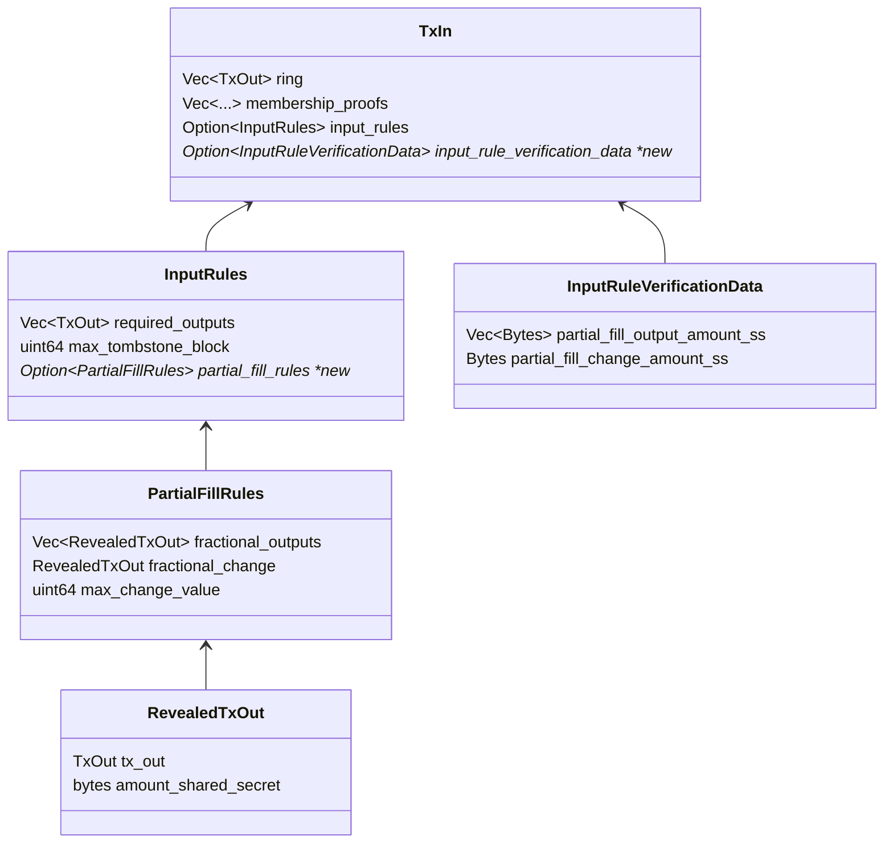

- Feature Name: Partial Fill Rules
- Start Date: 2022-06-02
- MCIP PR: [mobilecoinfoundation/mcips#0042](https://github.com/mobilecoinfoundation/mcips/pull/0042)
- Tracking Issue: [mobilecoinfoundation/mobilecoin#2081](https://github.com/mobilecoinfoundation/mobilecoin/issues/2081)

# Summary
[summary]: #summary

Extend the set of supported "input rules", to allow that someone can produce a signed order indicating willingness to trade "this for that", but moreover, "this for that, at this exchange rate, up to this volume".

# Motivation
[motivation]: #motivation

In MCIP #31 we proposed a way that two parties can swap assets -- the first one can make a signed offer to trade this for that using a "Signed Contingent Input", then anyone who agrees can add this to their transaction.

The way it was proposed, the first party has to state the total amount of the first asset and
the total amount of the second asset. But if the second party doesn't agree exactly, then they
may not proceed, so there is a need to negotiate exactly the price and the volume.

One way to make this more practical is that, the first party could instead sign that they are willing to trade at a particular price, up to a particular maximum volume. We call this a "partial fill", in analogy with partial-fill limit orders in traditional exchanges.

We want to extend the MCIP #31 functionality to support this.

# Guide-level explanation
[guide-level-explanation]: #guide-level-explanation

An input rules object may now optionally contain a "partial fill rules" specification.

When a Signed Contingent Input (SCI) containing partial fill rules is incorporated into a transaction, there is an implicit
"Partial fill fraction", which is the fraction of the maximum volume that is actually transacted.

A partial fill specification includes:

* A list of TxOut's that may be partially filled. Each tx out here is called a "fractional output".
* A fractional change output. This sends any left-over value from the signed input to the originator when the order is partially filled.
* A maximum change output value. This is configurable by the originator and allows them to an implied floor on the partial fill fraction to prevent filling the order for dust amounts, which can be a form of griefing.

To satisfy partial fill rules, all fractional outputs and the change output must appear in the TxPrefix, similarly as required_outputs in MCIP #31. However, the amounts of these TxOut's are allowed to be different -- every other field must be the same. Transaction validation must confirm that the amounts are different in an acceptable way.

For more complex rules, the counterparty may need to supply additional data to transaction validation to confirm such rules.
Therefore, a TxIn now has optional InputRuleVerificationData, which is required when partial fill rules are present.

In order to verify that partial fills were performed correctly, we must reveal the amounts of all fractional outputs and corresponding outputs in the `TxPrefix` to the enclave. To do this, we reveal the secret which underlies both the amount commitment and the masked value, so that the enclave can essentially do view-key matching on these TxOut's.

In order to avoid revealing unnecessary information, we modify the derivation of the value mask and the amount blinding factor of the Pedersen commitment from the TxOut shared secret. We introduce a second step, with a second key called the Amount shared secret.

The purpose is that instead of revealing the TxOut shared secret to the enclave, we can reveal the amount shared secret,
which permits unmasking the masked value and confirming against the Pedersen commitment, without revealing anything that
can impact the memos or the confirmation numbers.

Note that, this deviates from the model for "normal" transactions. For normal transactions, amounts are not revealed
even to the enclave, because it is unnecessary, and we can use RingCT to validate transactions without revealing the amounts. However, for partial fill swap transactions, the use-case is that SCI's are broadcast
to an exchange network -- the goal there is that both the originator and the counterparty are anonymous, but not that the amounts being offered to transact are secret. So when validating these swaps, keeping the amounts secret from the consensus enclave does not impact the threat model.

For compatibility, we propose that the TxOut structure is evolved per MCIP #26, so that
client software can support both the old and new derivation schemes. The old scheme must always be used
prior to block version 3, and the new scheme must always be used after block version 3.

The proposed changes to the `TxIn` structure and the input rules are captured in this diagram:

An example partial fill flow goes like this:
* Alice has an output for 1500 MOB. Alice would like to trade up to 1000 MOB for MEOWB at a price of 10 MEOWB/MOB.
  Alice doesn't want the order to happen unless the volume is at least .1 MOB.
* Alice creates an SCI using her 1500 MOB input.
  * She creates a required output to herself for 500 MOB
  * She creates a fractional output to herself for 10,000 MEOWB
  * She creates a fractional change output to herself for 1000 MOB
  * She sets the max_change_value to (1000 - .1) MOB, (but expresses this in picoMOB, the smallest representable units).
* Bob sees this order, and wants to trade 200 MEOWB for 20 MOB (+ transaction fee).
  * Bob adds this order to the transaction builder, and indicates that he wants to fill 2% of the order.
  * Bob adds an input worth at least 200 MEOWB + transaction fee.
  * Bob adds a change output with any MEOWB change to himself.
  * Bob assigns a 20 MOB output to himself.
  * The transaction builder appropriately attaches `InputRuleVerificationData` containing these amount shared secrets
    for any outputs corresponding to fractional outputs that it created.

When the transaction settles, Bob has paid net 200 MEOWB + transaction fee, and received net of 20 MOB.
Alice has paid a 1500 MOB output, and received the 500 MOB required output, and a 980 MOB fractional output,
as well as 200 MEOWB from Bob.

# Reference-level explanation
[reference-level-explanation]: #reference-level-explanation

TODO

# Drawbacks
[drawbacks]: #drawbacks

This proposal has a few drawbacks.

* The amounts of partial fill transactions are revealed to the enclave. Currently, MobileCoin transactions are validated using RingCT and do not reveal amounts to the enclave. It would be better if there were a way to validate partial fills without revealing this to the enclave, but for the use-cases envisioned, this data already has to be revealed anyways, so the use-cases aren't negatively impacted. We could imagine that an exchange service is based on SGX, and so the amounts of these orders are only revealed inside of SGX, and are matched inside of SGX. Even in this case, it is still the case that if you penetrate SGX you will see the amounts of the SCI orders.
* Partial-fill SCI orders cannot be re-used by a second counterparty later if the first counter-party only matched some of the volume.
In a traditional exchange, limit orders that are partially-filled remain on the books until being totally filled, so that potentially dozens of different parties can each match a piece of the liquidity provided by the originator. In this proposal, that would not work, because as soon as the first counterparty matches the order, the key image underlying the SCI is burned. One could imagine that there might be a way that the fractional change output which goes back to the originator could be automatically signed as an SCI somehow, so that matching can continue without the originator being in the loop. This proposal instead envisions that if the originator wants to continue matching they simply sign a new SCI themselves and re-broadcast.

# Rationale and alternatives
[rationale-and-alternatives]: #rationale-and-alternatives

An alternative design which we explored first attempted to use homomorphic properties of Pedersen commitments to verify correct partial fills without revealing them:

* Amount shared secret is not needed.
* Input rule verification data instead consists of a fraction, expressed as a u64 `numerator` and a u64 `denominator`.
* To verify equations like `real_output >= num / denom * fractional_output`, we clear denominators and convert to a form `X >= 0`.
  `denominator * real_output - num * fractional_output >= 0`. Then we consider the LHS as a "partial fill verification commitment"
  and fold this into the range proofs that already exist in the transaction. It is not too hard to see that the counter-party can always
  ensure that this number is in the range `[0, u64::MAX)` for a valid transaction.
* To verify the fractional change output, we need to verify an equation `(fraction_change - real_change) >= num / denom * real_change`.
  This could similarly be verified without revealing commitments by clearing denominators and converting to the form `X >= 0`, then using
  range proofs to verify the equation.

The problem with this design is that, in MobileCoin, as with all RingCT-based cryptocurrencies, the amount of a TxOut actually appears in two places -- a Pedersen commitment, and a masked_value. The masked_value is a more conventional, symmetric-key encryption of the TxOut value, while the Pedersen commitment is an elliptic curve point which commits to the value, but cannot itself be directly "decrypted" efficiently by someone who doesn't already know the value.

All recipients determine the value of their TxOut's by the following process:
* Derive the TxOut shared secret
* Use the TxOut shared secret to derive the value mask, token id mask, and the amount commitment blinding factor. This computation never fails with an error, but produces "conjectures" which are expected to be correct if the Recipient owns this TxOut.
* Unmask the masked value and token id, obtaining a u64 value and a token id. These may or may not be the correct value of the Pedersen commitment.
* Reconstruct the Pedersen commitment using these conjectured values and the amount commitment blinding factor. If this matches the commitment, then value recovery was successful.

Thus value recovery relies on the masked_value and the amount commitment actually encoding the same numbers. If this is not the case, then value recovery fails, even if the TxOut is truly owned by the recipient.

However, consensus does not validate in any way that the masked_value actually matches the amount commitment. It only validates the correctness of the commitments.

Historically, the rationale for this is as follows:
* In a simple transaction, if the sender intentionally sends an output to a recipient that has a bad masked_value, this is equivalent to sending money to into a hole. The recipient will not be able to recover the value, so they will not render services to the sender.
* In MCIP #31 atomic swaps without partial fills, the originator is setting the masked_value for the required outputs which are going to them. If the counterparty changes the masked_value at all, the transaction is invalid. So the originator can only poison their own masked value, which only throws their own money into a hole.

(This is also the reasoning for all other RingCT-based cryptocurrencies.)

However, once we start doing partial fills, now we have a situation where the counter-party has to create the masked value for the originator. If consensus does not in some way validate the masked value, then a griefing attack becomes possible:

* An originator makes a signed partial fill offer.
* A counterparty fills the offer, but poisons the masked values going to the originator.
* The counterparty walks away with their side of the exchange, and the originator technically received their fractional outputs, but view key matching fails to produce the correct value for these outputs, and so they cannot actually spend these outputs unless they brute-force the discrete logarithm over a u64 search space, which would be very expensive.

It is in principle possible that we could validate the masked value using a zero-knowledge proving framework. For example, in principle it is possible that a ZK-SNARK can prove that a particular Pedersen commitment and a particular masked_value both encrypt the same value, and this proof need not reveal what that value is.

However, this is an extremely complicated solution to this problem. Embedding both Ristretto scalar multiplication and blake2b hashing into a ZK-SNARK would mean that we are building zero-knowledge proofs that are similar in complexity to Zcash. Making this mobile-friendly becomes a challenging research problem. So this is for now a dead-end and something we could only hope to do later as part of an upgrade to all of the transaction math.

Another approach might involve migrating the masked_value from a simple symmetric-key encryption to something with homomorphic properties, so that we can verify it similarly to how we verify the partial-fill equations for the Pedersen commitments. However, this ultimately doesn't seem very promising, because even if we could homomorphically verify inequalities over the masked values, that isn't enough, because the masked value for each output has to actually match exactly to the corresponding Pedersen commitment, and two inequalities being satisfied doesn't imply this.

Since revealing the amount secret in the enclave is a much simpler way to resolve this, which doesn't negatively impact the threat model for users of a decentralized exchange based on this feature, this seems like the best way to move forward. We can revisit zero-knowledge proofs for partial fills at a later date when more infrastructure for this exists in our ecosystem.

# Prior art
[prior-art]: #prior-art

Much of the prior art from MCIP #31 also informs this MCIP.
Section 6.2 of the [Zexe paper](https://eprint.iacr.org/2018/962.pdf) is also worth reading.

# Unresolved questions
[unresolved-questions]: #unresolved-questions

At this point we aren't ready to specify exactly how the backwards compatibility works for the old (pre Amount shared secret) derivation and the new derivation of amount blinding factors from the TxOut shared secret. The idea is roughly that:

* We will introduce new fields (in TxOut or a constituent) using protobuf schema evolution, in a manner compatible with our hashing
* When performing view key matching, the presence of old or new fields in the protobuf will indicate which derivation to use
* Before block version 3, the old derivation must be used always. After block version 3, the new derivation must be used always.
* Partial fill rules are only valid starting at block version 3.

# Future possibilities
[future-possibilities]: #future-possibilities

In the future, if/when we replace SGX transaction validation entirely with zero-knowledge proofs, we should use that proving framework to also
support zero knowledge partial fill validation.
