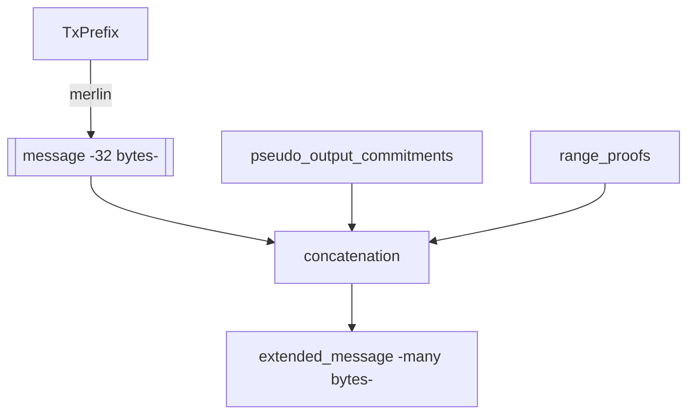
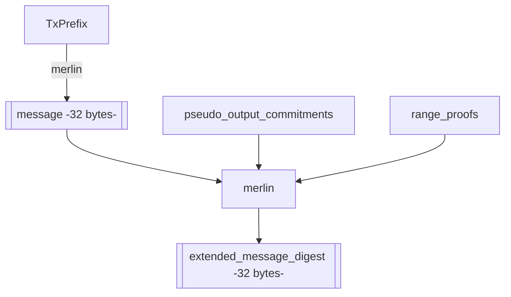
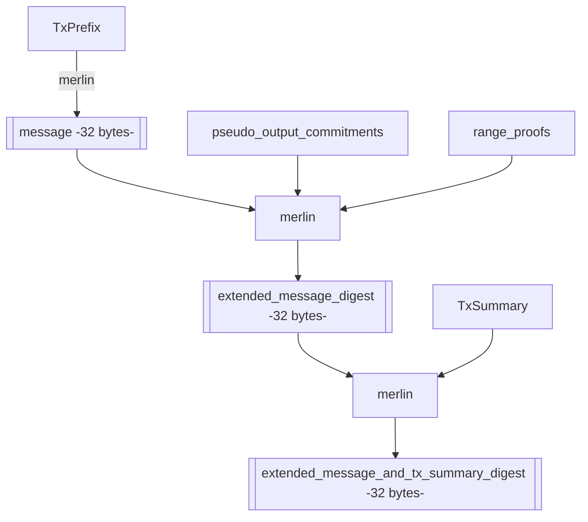
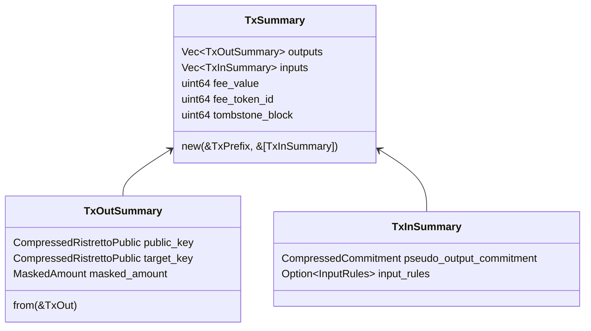
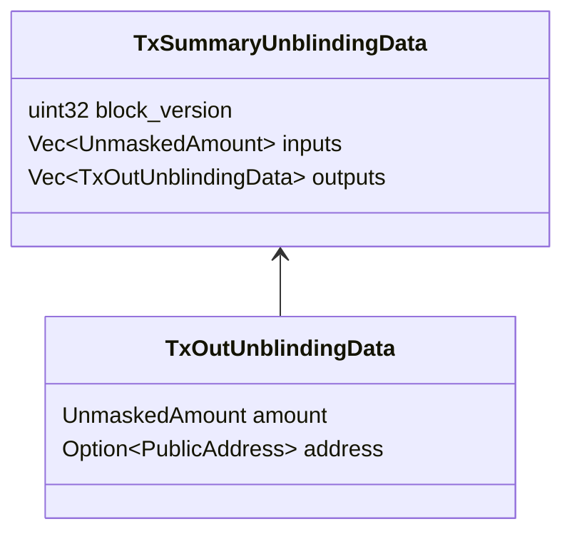

- Feature Name: tx_summary_digest
- Start Date: 2022-10-08
- MCIP PR: [mobilecoinfoundation/mcips#0052](https://github.com/mobilecoinfoundation/mcips/pull/0052)
- Tracking Issue: [mobilecoinfoundation/mobilecoin#2686](https://github.com/mobilecoinfoundation/mobilecoin/issues/2686)

# Summary
[summary]: #summary

Introduce a `TxSummary` that is significantly smaller than a `Tx`,
but which with small additional data can be used to verify the values of inputs
and outputs, and the destinations of the outputs, when a device is asked to sign
a `RingMLSAG` for a new transaction.

Where previously the `extended_message_digest` is signed by Ring MLSAGs
in a transaction, now a new digest formed using that digest and the `TxSummary` will
be signed instead.

# Motivation
[motivation]: #motivation

Hardware wallets such as Ledger have an expectation that when the user signs a
transaction, the device can display information about how much money will be sent
to what addresses as a result of this transaction, and that the device can verify
that this information is correct.

However, with the status quo, the only way that this can be accomplished is to put
the entire `Tx` on the device so that it can verify the `extended_message_digest`,
because the `extended_message_digest` is the only thing that connects the `MLSAG`
that the device is signing to the rest of the `Tx`.

This increases the amount of data that has to be sent to the device from a few KiB
to over 100KiB in the worst case. This is because Merkle proofs are around 40 bytes
per merkle element. With a height of 20-30 they may end up being 1 KB each.
Then, there is a Merkle proof for each `TxIn` (at most 16) and each mixin (11 per `TxIn`).

Having to transfer this much data to a tiny device will slow down the user experience
noticeably, and will greatly increase the complexity of implementation, because the device
has much less memory than this and would have to use some kind of "windowing" strategy
to compute the hash.

On the other hand, if the digest that the Ring MLSAGs sign is changed as proposed, then
we only need to send 32 bytes followed by the `TxSummary` to prove to the device where
the digest that the MLSAG's are signing comes from, and so what the outcome of the `Tx` is.
So we can avoid sending all Merkle proofs, bulletproofs, encrypted fog hints, memos, etc.
and reduce the traffic with the device by perhaps a factor of 10 or so in the worst case,
as well as reducing the implementation complexity.

# Guide-level explanation
[guide-level-explanation]: #guide-level-explanation

A `TxSummary` is an object much like the `TxPrefix`, but where instead of the `TxIn`
objects, the corresponding `pseudo_output_commitments` are stored.

There is exactly one possible `TxSummary` for a given `Tx`.

The `TxSummary` contains:
* The list of outputs (omitting "extra" parts like encrypted fog hint and encrypted memo).
* The list of `pseudo_output_commitments` (commitments to the values of the true inputs)
  * Any input rules associated to these inputs (if they are [MCIP 31](0031-transactions-with-contingent-inputs.md) signed contingent inputs)
* The fee and fee token id
* The tombstone block

During transaction construction, the signer computes the extended message digest as before,
but now creates a merlin transcript using that 32-byte digest, followed by digesting the
`TxSummary`. The MLSAG's (except for SCIs) will sign 32-bytes extracted from this digest.
The verifier similarly computes this
`extended-message-and-tx-summary digest` and verifies that the MLSAGs sign this.

When a hardware wallet is asked to sign an MLSAG, we can give it now the `extended_message_digest`
and the `TxSummary`, and it can compute the appropriate digest from this for the MLSAG to sign.

Additionally, we can provide it the `TxSummaryUnblindingData`, which inclues:
* For each `pseudo_output_commitment`, the amount (value and token id), and blinding factor.
* For each output, the target public address, the amount, and the `tx_private_key`, unless
  it is part of an SCI. In that case we can unblind it using the amount shared secret in the
  SCI input rules to find it's value, and we can't know
  exactly what address is the destination, except that it's associated to the SCI.
* The block version these outputs all targetted.

These data are not very large and allow the hardware wallet to verify the amounts of all
inputs and outputs in the `TxSummary` and to verify the destination of each output.

# Reference-level explanation
[reference-level-explanation]: #reference-level-explanation

In block version 0, the Ring MLSAG's sign the "extended message" computed roughly as follows:



In block version 2, we changed this (in [MCIP 25](https://github.com/mobilecoinfoundation/mcips/pull/25)) so that the Ring MLSAG's sign the
"extended message digest" which is computed roughly as follows:



We propose that in block version 3, Ring MLSAGs (other than the [MCIP 31](https://github.com/mobilecoinfoundation/mcips/pull/31) Signed Contingent Inputs)
should now sign the `extended_message_and_tx_summary_digest`,
which is computed roughly as follows:



Example code computing this new digest in a concrete way using the `mc-crypto-digestible` crate:

```rust
let mut transcript =
    MerlinTranscript::new(EXTENDED_MESSAGE_AND_TX_SUMMARY_DOMAIN_TAG.as_bytes());
extended_message.append_to_transcript(b"extended_message", &mut transcript);
tx_summary.append_to_transcript(b"tx_summary", &mut transcript);

let mut extended_message_and_tx_summary_digest = [0u8; 32];
transcript.extract_digest(&mut extended_message_and_tx_summary_digest);
```

This digest is computable given only the 32 byte `extended_message_digest`, and the
`TxSummary`, which are together much smaller than an entire `Tx`.

The `TxSummary` is a new object with the following schema.



A hardware wallet which is asked to sign an MLSAG can expect to see that 32 byte digest
and the `TxSummary`.

**Security**:
From a security point of view, the hardware wallet can know that it is intractable
for someone to find a different `TxSummary` that produces the same `extended_message_and_tx_summary` digest,
so if it signs the MLSAG, this is the only thing that it can be committing to.
The hardware wallet also knows how the validators will compute the `extended_message_and_tx_summary` digest
based on the `Tx`, and knows that it is infeasible for anyone to find another `Tx` that has the same digest here.
So, an attacker (on the computer) could give the device an improperly formed `TxSummary` and lie to the device
this way, but the attacker will not be able to get consensus to accept those signatures. The device therefore
knows that either the `TxSummary` is accurate, or it's signature doesn't matter because the `Tx` will not
be accepted.

A hardware wallet can also expect to be supplied with the `TxSummaryUnblindingData` which allows it to see
as much information as possible about where funds are coming from and where they are going in the `Tx`.



Strictly speaking, the `TxSummaryUnblindingData` is not part of the MobileCoin network's protocol rules,
it's rather a detail of the hardware wallets, and they might choose not to use this schema and do their
own thing. However, it is useful as a proof of concept, to validate that the `TxSummary` design does
actually achieve the goals we set out. This at least provides a starting point for hardware wallet projects
that does not involve sending the entire `Tx`.

# Drawbacks
[drawbacks]: #drawbacks

The main reason not to do this is that it somewhat increases the complexity of transaction validation.
It introduces more types and more schemas, and they have only niche use-cases.

It is also inelegant in that we hash a bunch of information into the extended message (by hashing the `TxPrefix`),
and then we hash it again via the `TxSummary`. The `TxSummary` contains much of the same information as the `TxPrefix`.

# Rationale and alternatives
[rationale-and-alternatives]: #rationale-and-alternatives

Although doing this increases the complexity of transaction validation, not doing it considerably increases
the complexity of hardware wallet implementation and could delay the ship date of practical hardware wallet support.

Although it is inelegant to hash a bunch of stuff a second time, in practical terms, the cost of doing this is very low.

There are many things that are inelegant about our current `Tx` structure. It is inelegant that the `TxPrefix` hash is not
the only thing that MLSAG's sign and that extra stuff from `SignatureRctBulletproofs` is signed. It would be better if this
`TxSummary` object *were* the `TxPrefix` to some extent, and the merkle proofs, bulletproofs, and other extra stuff were
digested before that. Then we would not need to have an extra round of hashing things at the end.

However, we do not propose at this time to completely change the `Tx` structure to fix these issues, as this would be
a very complicated breaking change.

Instead, we view this current proposal as the simplest and most straightforward proposal that will meet the needs of
hardware wallets and help them to avoid complexities around streaming too much data and having to create a state machine to
compute a proper merlin digest of the entire `Tx` object, which would also make the user experience significantly slower.

## SCI support, definition of `TxSummaryUnblindingData`

We have tried to future-proof this design against [MCIP 31](https://github.com/mobilecoinfoundation/mcips/pull/31) Signed Contingent Inputs being present in the `Tx`.
However, these cannot even be used until block version 3, and may not be in common use at the time that hardware wallet support
is actually shipped.

It may be that hardware wallets will initially cut scope and not seek to support that feature. Then, they could cut the `InputRules`
from the `TxInSummary`, (or rather, return an error if they are present) and they could assume that `address` is mandatory in `TxOutSummary::address`.

We view it as the prerogative of hardware wallets to define their own wire format as they see fit and carry out whatever compression / improvements they
think are appropriate. The `TxSummaryUnblindingData` schema is only meant as a proof of concept.

# Prior art
[prior-art]: #prior-art

None that we know of.

# Unresolved questions
[unresolved-questions]: #unresolved-questions

None at this time.

# Future possibilities
[future-possibilities]: #future-possibilities

If more fields are added to `Tx` or `TxPrefix` that would be interesting for hardware wallets to have visibility on, we should also add them
to `TxSummary`.
