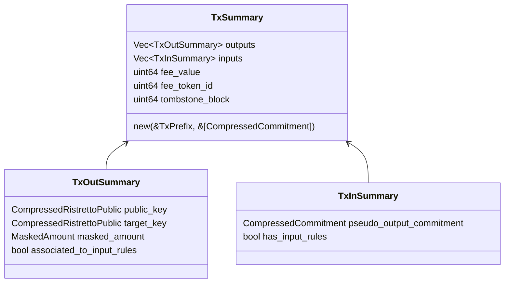
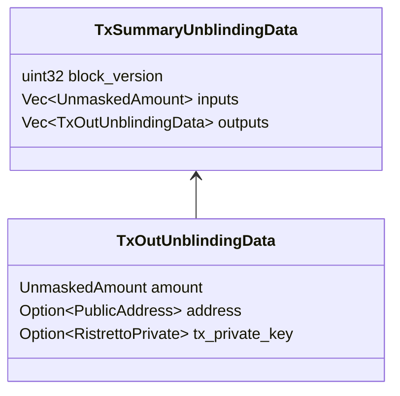

- Feature Name: tx_summary_digest
- Start Date: 2022-10-08
- MCIP PR: [mobilecoinfoundation/mcips#0052](https://github.com/mobilecoinfoundation/mcips/pull/0052)
- Tracking Issue: [mobilecoinfoundation/mobilecoin#2686](https://github.com/mobilecoinfoundation/mobilecoin/issues/2686)

# Summary
[summary]: #summary

Introduce a `TxSummary` that is significantly smaller than a `Tx`,
but which with small additional data can be used to verify the values of inputs
and outputs, and the destinations of the outputs, when a device is asked to sign
a `RingMLSAG` for a new transaction.

Where previously the `extended_message_digest` is signed by Ring MLSAGs
in a transaction, now a new digest formed using that digest and the `TxSummary` will
be signed instead.

# Motivation
[motivation]: #motivation

Hardware wallets such as Ledger have an expectation that when the user signs a
transaction, the device can display information about how much money will be sent
to what addresses as a result of this transaction, and that the device can verify
that this information is correct.

However, with the status quo, the only way that this can be accomplished is to put
the entire `Tx` on the device so that it can verify the `extended_message_digest`,
because the `extended_message_digest` is the only thing that connects the `MLSAG`
that the device is signing to the rest of the `Tx`.

This increases the amount of data that has to be sent to the device from a few KiB
to over 100KiB in the worst case. This is because Merkle proofs are around 40 bytes
per merkle element. With a height of 20-30 they may end up being 1 KB each.
Then, there is a Merkle proof for each `TxIn` (at most 16) and each mixin (11 per `TxIn`).

Having to transfer this much data to a tiny device will slow down the user experience
noticeably, and will greatly increase the complexity of implementation, because the device
has much less memory than this and would have to use some kind of "windowing" strategy
to compute the hash.

On the other hand, if the digest that the Ring MLSAGs sign is changed as proposed, then
we only need to send 32 bytes followed by the `TxSummary` to prove to the device where
the digest that the MLSAG's are signing comes from, and so what the outcome of the `Tx` is.
So we can avoid sending all Merkle proofs, bulletproofs, encrypted fog hints, memos, etc.
and reduce the traffic with the device by perhaps a factor of 10 or so in the worst case,
as well as reducing the implementation complexity.

# Guide-level explanation
[guide-level-explanation]: #guide-level-explanation

A `TxSummary` is an object much like the `TxPrefix`, with small but important differences
in exactly what data are stored about inputs and outputs.

The purpose of a `TxSummary` is that:
* It is much smaller than a `Tx`.
* It can be streamed to a small hardware device, together with the `extended_message_digest`,
  in order to efficiently compute the (new) digest which MLSAG's must sign.
* Small additional data (`TxSummaryUnblindingData`) can be streamed with the pieces of the `TxSummary`, allowing
  the device to "unblind" the `TxSummary`.
* This can be used to create a `TxSummaryUnblindingReport`, which deduces the following:
  * For each output, the amount, and the entity to which it is destined, which is one of three possibilities:
    * The signer themselves
    * A known contact, identified by their public address
    * An anonymous swap counterparty
  * For each input, the amount, and the entity from whcih it came, which is one of two possibilities:
    * The signer themselves
    * An anonymous swap counterparty

The design goals here are:
* A hardware device which is expected to sign MLSAGs for a transaction, can do so while having **visibility
  into how much funds** are being moved **from whom**, and **to whom** they are going.
* A hardware device can use the `TxSummaryUnblindingReport` to display this (verified) information to the user.
* The hardware device need not trust the host computer to verify this information.

There is exactly one possible `TxSummary` for a given `Tx`.

To achieve the goals, and make it unnecessary for the device to see the majority of the `Tx`, we have
to change the way that the digest which `RingMLSAG`'s sign is computed.

**Note**: This change does not impact the digest that [MCIP 31](0031-transactions-with-contingent-inputs.md) signed contingent inputs (SCIs) sign,
those inputs sign the same digest that was specified in MCIP 31.

During transaction construction, the signer computes the extended message digest as before,
but now creates a merlin transcript using that 32-byte digest, followed by digesting the
`TxSummary`. The MLSAG's (except for SCIs) will sign 32-bytes extracted from this digest.
The verifier similarly computes this
`extended-message-and-tx-summary digest` and verifies that the MLSAGs sign this.

**Note**: This means that the `TxSummary` needs to be constructible by the consensus enclave, given only
the `Tx`, and therefore cannot contain any of the transaction secrets needed to unblind the `TxSummary`. These
secrets appear in `TxSummaryUnblindingData` instead. The host computer (ultimately the `TransactionBuilder`)
is responsible to compute this when it creates
a `Tx`, and then it can be streamed to, and verified by, the hardware device which is asked to sign.

When a hardware wallet is asked to sign an MLSAG, we can give it now the `extended_message_digest`
and steam it the `TxSummary` and the `TxSummaryUnblindingData`, and it can compute the appropriate digest from this for the MLSAG to sign.

## Estimates

We would like to provide estimates of the impact of this change.

### Status quo

In the status quo, MLSAG's sign the 32-byte `extended-message-digest`.

To compute this digest, the entire `TxPrefix` must be digested, and then most of the
`SignatureRctBulletproofs` must be digested on top of this digest. Substantially all of the `Tx`
must be passed to merlin to verify this digest.

If hardware wallets do not compute this digest on the device, then they can have no visibility into
the `TxPrefix.outputs` list, which is what must be unblinded and verified to determine where output
funds are actually going in the transaction. (These are the outputs that will actually be added to
the blockchain.)

Therefore, without this change, the only way to achieve the requirement of giving hardware wallets
visibility into the outcome of the transaction they are signing is to stream substantially all of the `Tx`
to them.

Koe has previously in [MCIP 21](https://github.com/mobilecoinfoundation/mcips/pull/21) estimated the
size of a Tx, assuming that there are ~4 billion TxOut's in the ledger, leading the Merkle proofs with ~32
elements.

> Currently (protocol v0), Merkle membership proofs constitute the bulk of transaction size. A 1-input/1-output transaction is ~21 kB, with membership proofs taking up ~17 kB (assuming membership proofs with 32 elements, representing a Merkle tree 31 layers deep). In a 16-input/16-output transaction (the maximum size of a transaction), membership proofs occupy ~275 kB out of ~325 kB.

In mainnet at time of writing, with about 1 million blocks in the ledger, this would be only 22 elements, but this is still > 200 KB in total that must be streamed.

In the proof-of-concept work for this proposal, we measured exactly the size on the wire of a max-size and min-size Tx's with 32 element merkle proofs: 

-------------------------------------------------------------------------------------------------------
|                               | Min-size (1 input, 1 output) Tx | Max-size (16 input, 16 output) Tx |
|-------------------------------|---------------------------------|-----------------------------------|
| Proto-encoded tx size (bytes) | 20_020                          | 309_238                           |
-------------------------------------------------------------------------------------------------------

Note that this still does not give the device enough to actually compute the data in the `TxSummaryUnblindingReport`,
it would still need at least the data in the `TxSummaryUnblindingData` to see the amounts and entities associated to
the inputs and outputs.

### This proposal

In the proof of concept, MLSAG's sign the 32 byte `extended-message-and-tx-summary-digest`.

To verify this digest, the amounts and destinations of the outputs, and the amounts and sources of the inputs, we must send to the device:
* The 32-byte `extended-message-digest`
* The `TxSummary` (piecewise)
* The `TxSummaryUnblindingData` (piecewise)

--------------------------------------------------------------------------------------------------------------
|                                      | Min-size (1 input, 1 output) Tx | Max-size (16 input, 16 output) Tx |
|--------------------------------------|---------------------------------|-----------------------------------|
| Proto-encoded TxSummary size (bytes) | 176                             | 2_726                             |
| " TxSummaryUnblindingData (bytes)    | 295                             | 4_690                             |
| Total (+ 32)                         | 503                             | 7_416                             |
--------------------------------------------------------------------------------------------------------------

The size on the stack of the `TxSummaryStreamingVerifier` (using `heapless`) is 1_302 bytes.

The `TxSummaryStreamingVerifier` has four steps in its protocol:
* Initialization
* Digest output
* Digest input
* Finalization

The sizes of the payloads which must be transferred to make each step (in the POC) are:

--------------------------------------------------------------------------
|                                      | Wire size (proto-encoded bytes) |
|--------------------------------------|---------------------------------|
| Initialization                       | 32 + 32 + 4 + 2 * 8 = 84        |
| Digest output                        | 129 + 243 = 372                 |
| Digest input                         | 36  + 45  = 81                  |
| Finalization                         | 3 * (2 + 8) = 30                |
--------------------------------------------------------------------------

The largest value in the above is the Digest output step, and the bulk of this is coming
from the need to send a `PublicAddress` in order to verify that a `TxOut` was
correctly addressed to a `PublicAddress` and then display b58 (or an associated hash)
of this `PublicAddress`.

Verifying each output / input unblinding data entails a few elliptic curve operations in the above.

### Conclusions

The proposal always reduces the total amount of data that needs to be streamed by a factor of >40x.

Anecdotally, it takes about 10s to install an 80 KB app on the ledger nano S.

This suggests about 2.5s to stream the entire `Tx` to the ledger nano S when the `Tx` has the minimum possible size,
and about 40s to stream a max-size `Tx`.

It suggests that it should take <.25s to stream all of the data required by the `TxSummaryStreamingVerifier`,
even for a max-size `Tx`.

90% of the impact of this change comes from making it so that we don't have to stream merkle proofs to the hardware device.
The hardware device does not care about these merkle proofs anyways, and isn't capable of checking them.

More savings comes from omitting the encrypted fog hints and encrypted memos of Tx's, as well as all of the TxOut's associated
to input rings. Only the pseudo output commitments and pseudo output blinding factors associated to inputs, as well as a flag
indicating if there are associated input rules, are streamed to the device.

# Reference-level explanation
[reference-level-explanation]: #reference-level-explanation

In block version 0, the Ring MLSAG's sign the "extended message" computed roughly as follows:


In block version 2, we changed this (in [MCIP 25](https://github.com/mobilecoinfoundation/mcips/pull/25)) so that the Ring MLSAG's sign the
"extended message digest" which is computed roughly as follows:


We propose that in block version 3, Ring MLSAGs (other than the [MCIP 31](https://github.com/mobilecoinfoundation/mcips/pull/31) Signed Contingent Inputs)
should now sign the `extended_message_and_tx_summary_digest`,
which is computed roughly as follows:


Example code computing this new digest in a concrete way using the `mc-crypto-digestible` crate:

```rust
let mut transcript =
    MerlinTranscript::new(EXTENDED_MESSAGE_AND_TX_SUMMARY_DOMAIN_TAG.as_bytes());
extended_message.append_to_transcript(b"extended_message", &mut transcript);
tx_summary.append_to_transcript(b"tx_summary", &mut transcript);

let mut extended_message_and_tx_summary_digest = [0u8; 32];
transcript.extract_digest(&mut extended_message_and_tx_summary_digest);
```

This digest is computable given only the 32 byte `extended_message_digest`, and the
`TxSummary`, which are together much smaller than an entire `Tx`.

The `TxSummary` is a new object with the following schema.



A hardware wallet which is asked to sign an MLSAG can expect to see that 32 byte digest
and the `TxSummary`.

# Security
[security]: #security
From a security point of view, the hardware wallet can know that it is intractable
for someone to find a different `TxSummary` that produces the same `extended_message_and_tx_summary` digest,
so if it signs the MLSAG, this is the only thing that it can be committing to.
The hardware wallet also knows how the validators will compute the `extended_message_and_tx_summary` digest
based on the `Tx`, and knows that it is infeasible for anyone to find another `Tx` that has the same digest here.
So, an attacker (on the computer) could give the device an improperly formed `TxSummary` and lie to the device
this way, but the attacker will not be able to get consensus to accept those signatures. The device therefore
knows that either the `TxSummary` is accurate, or it's signature doesn't matter because the `Tx` will not
be accepted.

A hardware wallet can also expect to be supplied with the `TxSummaryUnblindingData` which allows it to see
as much information as possible about where funds are coming from and where they are going in the `Tx`.



Strictly speaking, the `TxSummaryUnblindingData` is not part of the MobileCoin network's protocol rules,
it's rather a detail of the hardware wallets, and they might choose not to use this schema and do their
own thing. However, it is useful as a proof of concept, to validate that the `TxSummary` design does
actually achieve the goals we set out. It at least provides a starting point for hardware wallet projects
that does not involve sending the entire `Tx`.

# Drawbacks
[drawbacks]: #drawbacks

The main reason not to do this is that it somewhat increases the complexity of transaction validation.
It introduces more types and more schemas, and they have only niche use-cases.

It is also inelegant in that we hash a bunch of information into the extended message (by hashing the `TxPrefix`),
and then we hash it again via the `TxSummary`. The `TxSummary` contains much of the same information as the `TxPrefix`.

# Rationale and alternatives
[rationale-and-alternatives]: #rationale-and-alternatives

Although doing this increases the complexity of transaction validation, not doing it considerably increases
the complexity of hardware wallet implementation and could delay the ship date of practical hardware wallet support.

Although it is inelegant to hash a bunch of stuff a second time, in practical terms, the cost of doing this is very low.

There are many things that are inelegant about our current `Tx` structure. It is inelegant that the `TxPrefix` hash is not
the only thing that MLSAG's sign and that extra stuff from `SignatureRctBulletproofs` is signed. It would be better if this
`TxSummary` object *were* the `TxPrefix` to some extent, and the merkle proofs, bulletproofs, and other extra stuff were
digested before that. Then we would not need to have an extra round of hashing things at the end.

However, we do not propose at this time to completely change the `Tx` structure to fix these issues, as this would be
a very complicated breaking change.

Instead, we view this current proposal as the simplest and most straightforward proposal that will meet the needs of
hardware wallets and help them to avoid complexities around streaming too much data and having to create a state machine to
compute a proper merlin digest of the entire `Tx` object, which would also make the user experience significantly slower.

## SCI support, definition of `TxSummaryUnblindingData`

We have tried to future-proof this design against [MCIP 31](https://github.com/mobilecoinfoundation/mcips/pull/31) Signed Contingent Inputs being present in the `Tx`.
However, these cannot even be used until block version 3, and may not be in common use at the time that hardware wallet support
is actually shipped.

It may be that hardware wallets will initially cut scope and not seek to support that feature. Then, they could cut the `InputRules`
from the `TxInSummary`, (or rather, return an error if they are present) and they could assume that `address` is mandatory in `TxOutSummary::address`.

We view it as the prerogative of hardware wallets to define their own wire format as they see fit and carry out whatever compression / improvements they
think are appropriate. The `TxSummaryUnblindingData` schema is only meant as a proof of concept.

# Prior art
[prior-art]: #prior-art

None that we know of.

# Unresolved questions
[unresolved-questions]: #unresolved-questions

None at this time.

# Future possibilities
[future-possibilities]: #future-possibilities

If more fields are added to `Tx` or `TxPrefix` that would be interesting for hardware wallets to have visibility on, we should also add them
to `TxSummary`.
