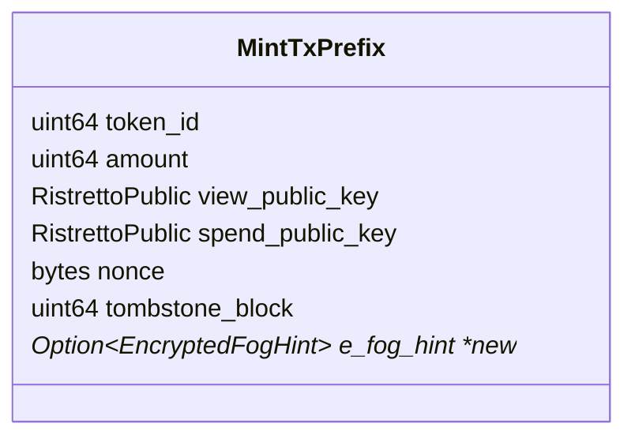

- Feature Name: minting_to_fog_addresses
- Start Date: 2022-10-9
- MCIP PR: [mobilecoinfoundation/mcips#0053](https://github.com/mobilecoinfoundation/mcips/pull/0053)
- Tracking Issue: None yet

# Summary
[summary]: #summary

Extend the spec for [MCIP 37](https://github.com/mobilecoinfoundation/mcips/pull/37),
allowing minting directly to Fog addreses.

# Motivation
[motivation]: #motivation

The main motivation is to allow creating a non-custodial cross-chain bridge
with no humans in the loop that can be used from a phone.

# Guide-level explanation
[guide-level-explanation]: #guide-level-explanation

The `MintTx` now contains an optional fog hint. If provided, the consensus enclave
uses it with the resulting `TxOut`.

# Reference-level explanation
[reference-level-explanation]: #reference-level-explanation

The `MintTxPrefix` schema is extended with a new optional field:

The consensus enclave uses this for the `TxOut` which results from a `MintTx`
if this field is present, otherwise the behavior is the same as before.

The consensus-mint-client should be extended to support fog addresses using
this feature.

# Drawbacks
[drawbacks]: #drawbacks

There isn't any obvious drawback from doing this.

The main reason that it wasn't done was that it wasn't required for the kinds
of bridges we envisioned initially.

There is a minor drawback in that nothing else in the `MintTxPrefix` is encrypted,
and we normally want the `MintTx` to be as transparent as possible.
But the spend and view public keys are generally enough
to identify a recipient uniquely anyways.
The only thing which can occur from attaching a bad fog hint is that the recipient
doesn't find their money via Fog.

# Rationale and alternatives
[rationale-and-alternatives]: #rationale-and-alternatives

The main alternative would be to pass the fog url of the address on to the consensus
network. Since the `MintTx` contains the public keys of the address, this is fairly
natural.

However, this creates a ton of problems in the consensus service itself.
* Consensus service now has to be able to fetch fog reports
* Consensus nodes may have different levels of connectivity to fog report servers.
* Creates more connections between different nodes of an already complex distributed system.

Instead it makes more sense to make the caller resolve Fog, and pass the resolved `e_fog_hint`
to the consensus network. The `MintTx` already contains a tombstone block anyways.

As a rule of thumb, we should usually want to push complexity to the edges of the
network when possible and not make the consensus validators more complex than they
already are. In some cases, there is a benefitial tradeoff where the consensus network
can become only a little more complex in exchange for a great reduction of complexity
on the client side, but this doesn't seem to be one of those cases.

# Prior art
[prior-art]: #prior-art

None that we are aware of.

# Unresolved questions
[unresolved-questions]: #unresolved-questions

None at this time.

# Future possibilities
[future-possibilities]: #future-possibilities

There are no obvious future possibilities.
