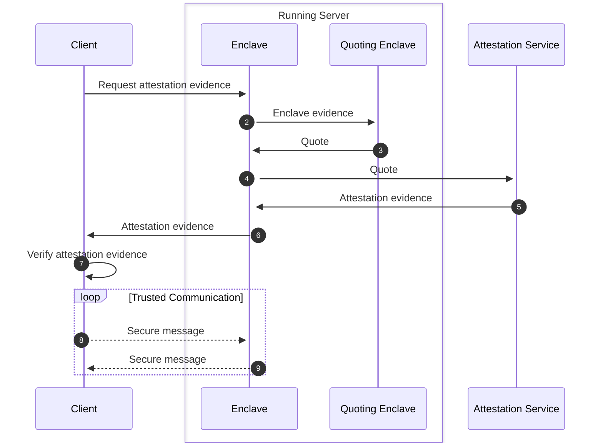
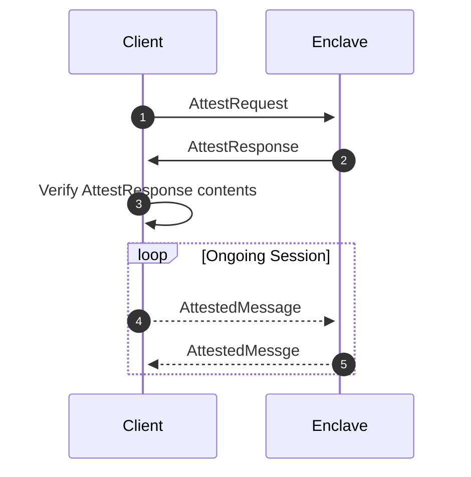
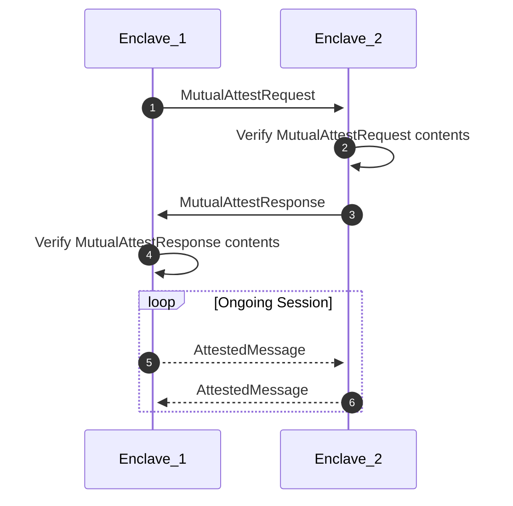

- Feature Name: `attestation-grpc-apis`
- Start Date: 2023-03-14
- MCIP PR: [mobilecoinfoundation/mcips#0063](https://github.com/mobilecoinfoundation/mcips/pull/0063)
- Tracking Issue: [mobilecoinfoundation/mobilecoin#3119](https://github.com/mobilecoinfoundation/mobilecoin/issues/3119)

# Summary
[summary]: #summary

Define the [gRPC](https://grpc.io/) APIs used to perform attestation of an enclave.

# Motivation
[motivation]: #motivation

The current gRPC attestation API only supports a stream of opaque bytes. This
requires both parties to know how to interpret this data outside of the gRPC
API.

The newer
[Intel® SGX DCAP](https://www.intel.com/content/www/us/en/developer/articles/technical/quote-verification-attestation-with-intel-sgx-dcap.html)
attestation protocol uses a different format for the attestation evidence than
the previous
[EPID](https://api.trustedservices.intel.com/documents/sgx-attestation-api-spec.pdf)
protocol. The use of an opaque buffer of bytes prevents the recipient of the
attestation evidence from knowing if the evidence is for EPID or DCAP.

We want to provide an alternative gRPC API that will be expandable to better
support future attestation evidence format updates.

# Guide-level explanation
[guide-level-explanation]: #guide-level-explanation

An _enclave_ is the name given for an application running in an Intel SGX
[trusted execution environment](https://en.wikipedia.org/wiki/Trusted_execution_environment).
Enclave's provide attestation evidence to requesting clients. This attestation
evidence provides assurance that the enclave has not been modified and that the
hardware the enclave is running on is not subject to any unnacceptable
configurations (hyperthreading is disabled, on board GPU is disabled, etc).

Prior to trusted communication with an encalve, a client will request the
attestation evidence and verify it's correctness. Once verified, the client will
use an encryption key provided in the attestation evidence to further
communicate with the enclave in a trusted manner.

## Creating Attestation Evidence

The enclave to be verified will communicate with a trusted quoting enclave (QE)
in the same machine. This quoting enclave will sign the evidence provided by the
enclave to be verified. This signed evidenced is refered to as a _quote_.  The
quote is sent to an attestation service which will verify the quoting enclave's
signature. This service will verify and sign the quote, creating the attesation
evidence that clients expect.



The purpose of this MCIP is to better define the data format of the attestation
evidence that enclaves provide to clients.

# Reference-level explanation
[reference-level-explanation]: #reference-level-explanation

There are two common ways of attesting with an enclave:

1. [Client to enclave](#1-client-to-enclave)
2. [Enclave to enclave](#2-enclave-to-enclave)

The provided services support these two ways:

```prost
service AttestService {
    rpc Attest(AttestRequest) returns (AttestResponse);
    rpc MutualAttest(MutualAttestRequest) returns (MutualAttestResponse);
}
```

The regular `Attest` endpoint is for client to enclave attestation. The
`MutualAttest` endpoint is for enclave to enclave attestation.

## 1. Client to Enclave

Client to enclave is for usages like a mobile device or a wallet communicating
with an enclave.



## 2. Enclave to Enclave

Enclave to enclave attestation is for enclaves on disparate machines
communicating with each other. A common use case is for communication between
concensus nodes.

Enclave to encalve attestation differs from
[client to enclave](#1-client-to-enclave) in that the requester will provide its
own attestation evidence when requesting attestation evidence from the other
enclave. The enclave recieving the request will verify the evidence of the
requesting enclave before responding.



## Message Types

### `AttestRequest`

Used to initiate client to enclave communication.

The `noise` field contains
[noise protocol](http://www.noiseprotocol.org/) handshake data.

```prot
message AttestRequest {
    bytes noise = 1;
}
```

### `AttestResponse`

Contains the noise protocol handshake data and the attestation evidence that
needs to be verified by the recipient

```proto
message AttestResponse {
    bytes noise = 1;
    AttestationEvidence evidence = 2;
}
```

### `AttestationEvidence`

A [`oneof`](https://protobuf.dev/programming-guides/proto3/#oneof) is used to
allow for new evidence types to be provided in the future.

The name `quote3` was chosen to mimic the naming of the binary format that Intel
uses for the DCAP attestation service. It is possible to get other attestation
types via a DCAP service.

```proto
message AttestationEvidence {
    oneof evidence {
        QuoteV3Evidence quote3 = 1;
    }
}
```

### `Quote3Evidence`

The name `Quote3Evidence` was chosen to mimic the naming of the binary format
that Intel uses for the DCAP attestation service. It is possible to get other
attestation types via a DCAP service.

The `Quote3Evidence` is composed of two parts:

1. Quote
2. TCB ([Trusted Computing Base](https://en.wikipedia.org/wiki/Trusted_computing_base))

```proto
message QuoteV3Evidence {
    QuoteV3 quote = 1;
    TcbInfo tcb = 2;
}

```

### `QuoteV3`

The name `QuoteV3` was chosen to mimic the naming of the binary format that
Intel uses for the DCAP attestation service. It is possible to get other
attestation types via a DCAP service.

The quote format is described in
[Intel_SGX_ECDSA_QuoteLibReference_DCAP_API.pdf](https://download.01.org/intel-sgx/latest/dcap-latest/linux/docs/Intel_SGX_ECDSA_QuoteLibReference_DCAP_API.pdf).
The quote is kept in its binary format as provided by the attestation service.
The preservation of the binary format is due to the verification process of the
quote requiring the computation of a digest over the raw quote bytes.

```proto
message QuoteV3 {
    bytes quote = 1;
}
```

### `TcbInfo`

The `TcbInfo` provided here differs from that defined in
<https://api.portal.trustedservices.intel.com/documentation#pcs-tcb-info-model-v3>.
Instead of a JSON file with both the `tcbInfo` and the `signature` attributes,
the `tcbInfo` attribute is sent as a JSON document and the `signature` is a
separate element. This prevents clients from parsing an unverified JSON document
to get to the signature.  See [`SignedJson`](#signedjson).

```proto
message TcbInfo {
    SignedJson tcb = 1;
}
```

### `SignedJson`

The `signature` will be the signature over the `json` field. The `der_chain`
contains the public key used to verify the `signature`.

The `json` field will contain _only_ the `tcbInfo` object from
<https://api.portal.trustedservices.intel.com/documentation#pcs-tcb-info-model-v3>.

The `der_chain` contains a certificat chain. Clients are responsible for
providing access to the root CA signature. Many embedd this signature in their
application.

```proto
message SignedJson {
    bytes signature = 1;
    string json = 2;
    repeated bytes der_chain = 3;
}
```

### `MutualAttestRequest`

Used when enclaves wish to communicate with each other. The enclaves are the
exact same build, but running on different machines.

The requester provides the noise protocol handshake data and its own attestatoin
evidence.

```proto
message MutualAttestRequest {
    bytes noise = 1;
    AttestationEvidence evidence = 2;
}
```

### `MutualAttestResponse`

Same as [`AttestResponse`](#attestresponse)

```proto
message MutualAttestResponse {
    bytes noise = 1;
    AttestationEvidence evidence = 2;
}
```

# Drawbacks
[drawbacks]: #drawbacks

Creating new services for attestation results in both clients and enclaves need
supporting both the legacy interface as well as this new one.  

# Rationale and alternatives
[rationale-and-alternatives]: #rationale-and-alternatives

Defining a more specific gRPC message API for attestation allows for more
flexibility moving forward.

We could put the new attestation evidence in the opaque bytes of the current
attestation message. It would require providing a way for clients to know what
kind of attestation evidence is in the bytes. It also further hides the actual
attestestation structure from the clients.

We could embed this defenition of the attestation data in the opaque bytes of
the current attestation message. That solution suffers from the same limitations
as putting the new attestation evidence directly in the opaque bytes.

# Prior art
[prior-art]: #prior-art

Azure has an attestation REST API,
<https://learn.microsoft.com/en-us/rest/api/attestation/attestation/attest-sgx-enclave?tabs=HTTP>.
This contains a `quote` element which mentions that the type is dependent on the
attestation policy. This leaves it to the client to make a separate request to
get the TCB information.

Teaclave uses gRPC with a generic payload that is deserialized as JSON,
<https://teaclave.apache.org/docs/codebase/rpc/>. This limits to one message
type, which means it limits to clients only needing to know about one service.
Clients need to deserialize and redirect the message to the correct recipient.

# Unresolved questions
[unresolved-questions]: #unresolved-questions

- Do we need/want to support the EPID attestation evidence in these new
  messages? There is the capability for it. It seems like clients that know
  about this new endpoint will use DCAP since EPID is end of life.
- How do we transition clients to the new service?

# Future possibilities
[future-possibilities]: #future-possibilities

None at this time.
