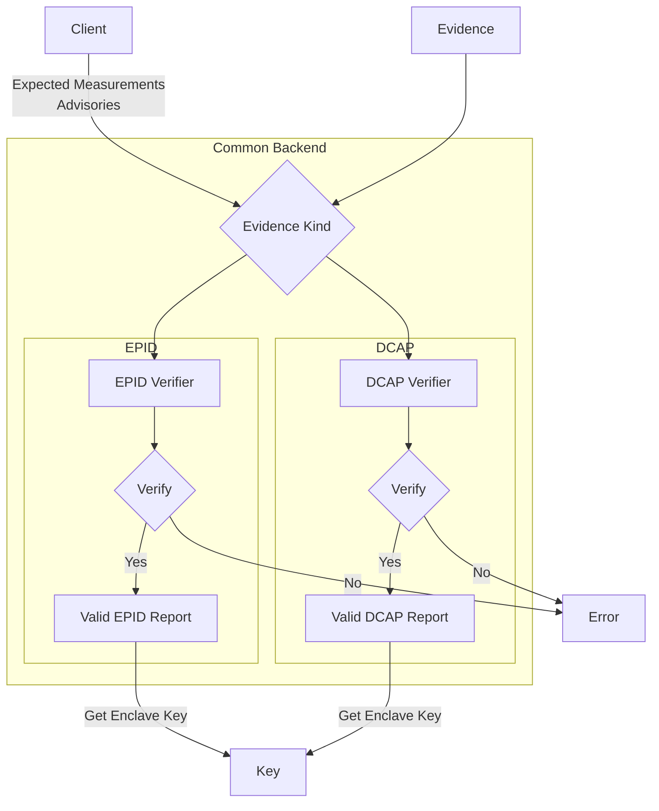
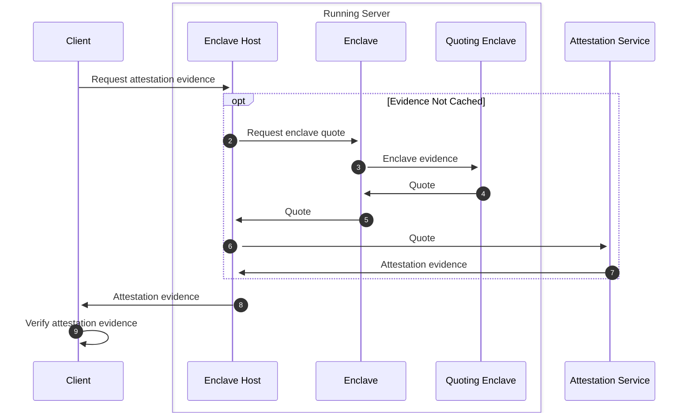

- Feature Name: `dcap_attestation_evidence`
- Start Date: 2023-05-31
- MCIP PR: [mcips #65](https://github.com/mobilecoinfoundation/mcips/pull/65)
- Tracking Issue: [mobilecoin #3119](https://github.com/mobilecoinfoundation/mobilecoin/issues/3119)

# Summary
[summary]: #summary

Support for verifying both EPID and DCAP quotes in the same codebase.

# Motivation
[motivation]: #motivation

We want to provide uninterrupted client support of the MobileCoin services when
the services transition from EPID to DCAP attestation.

In order to support this uninterrupted transition, clients will need to have
logic for verifying both the EPID and DCAP flavors of attestation evidence.

# Guide-level explanation
[guide-level-explanation]: #guide-level-explanation

Clients provide a list of expected measurements and advisories to a common
backend. The common backend is responsible for determining how to verify
the attestation evidence with these expected measurements.

Previous versions of the MobileCoin client libraries created an EPID verifier and provided the verifier to a common backend to verify the attestation evidence.

A _Measurement_ is either a `MRENCLAVE` value or a `MRSIGNER` value set.

`MRENCLAVE`
: value is a hash that uniquely identifies the enclave's code
binary. A `MRENCLAVE` measurement is a strict comparison, any change in the
enclave's code binary will result in a verification failure.

`MRSIGNER`
: is a more lenient verification which allows for newer versions of
an enclave's code binary to be used. A `MRSIGNER` value set consists of three
values:

1. A hash that uniquely identifies the entity or group that signed the enclave.
   This is often refereed to as the `MRSIGNER` value, not to be confused with the
   _`MRSIGNER` value set_ being described here.
2. The enclave's security version number. This number is incremented when the
   enclave is updated with security fixes. This is referred to as the ISV SVN. An
   enclave that has a higher security version number will still pass
   verification as it is assumed to be more secure than the previous security
   version.
3. The enclave's product version number. This number varies based on the
   enclave's purpose. For example, fog view has a different product version
   number than consensus. This is often referred to as the ISV product ID.

Advisories are a list of advisory IDs that an enclave is allowed to have. If
there is an advisory ID in the evidence that is not in the allowed list, the
verification will fail.

The verifier interprets the evidence and verifies that the
evidence meets the requirements for the expected measurements and advisories.

The verifier also ensures that the evidence is signed by a trusted party. This
signature is provided in an X509 certificate chain that is verified by a trust
root.

The MobileCoin enclaves will contain the enclave's public key in the evidence.
The verification of the evidence proves the validity of the public key. A common
output of verifying an enclave's evidence is the enclave's public key.



# Reference-level explanation
[reference-level-explanation]: #reference-level-explanation

## Advisories

The advisories are separated into two categories:

1. Software hardening: These are advisories that are mitigated by the software
   implementation.
2. Config: These are advisories that are mitigated by the specific hardware
   configuration. For example disabling of hyperthreading, disabling of onboard
   GPU, updates to microcode, etc.

The client provides two lists of advisory IDs, one for each category. The lists
contain the advisory IDs that the client is willing to accept. If the evidence
contains an advisory ID that is not in the list, the verification will fail.

At the time of this writing no config advisories are allowed. This means that
clients expect all advisories to be mitigated by the correct configuration of
the hardware.

For software hardening advisories, the only way to ensure the advisory has been
mitigated is through the software implementation. This means that the evidence
the enclave provides will not be able to prove that the advisory has been
mitigated. Thus the evidence will list all software advisories which the enclave
may be susceptible to. It is up to the client to know which versions of the
enclave has mitigated which advisories.

For example if a new software advisory "INTEL-SA-12345" is published, enclave
version _n_  may not have mitigated this advisory. The client should **not** list
"INTEL-SA-12345" in the list of allowed advisories when talking to enclave
version _n_. The the client would provide "INTEL-SA-12345" for enclave version
_n+1_, assuming enclave version _n+1_ provides necessary software mitigations for the
advisory. The client would still not provide "INTEL-SA-12345" for enclave
version _n_ since it does not have the necessary mitigations.

## Combined Measurement and Advisory Format

In JSON format for the combined measurment and advisories are of the form:

`MRENCLAVE`

```json
{
  "MRENCLAVE": "3370f131b41e5a49ed97c4188f7a976461ac6127f8d222a37929ac46b46d560e",
  "mitigated_config_advisories": ["INTEL-SA-XXXXX"],
  "mitigated_hardening_advisories": ["INTEL-SA-00334", "INTEL-SA-00615"]
}
```

`MRSIGNER`

```json
{
  "MRSIGNER": "2c1a561c4ab64cbc04bfa445cdf7bed9b2ad6f6b04d38d3137f3622b29fdb30e",
  "product_id": 1,
  "minimum_svn": 5,
  "mitigated_config_advisories": ["INTEL-SA-XXXXX"],
  "mitigated_hardening_advisories": ["INTEL-SA-00334", "INTEL-SA-00615"],
}
```

## Evidence Format

The term _Evidence_ is used in this MCIP to refer to all the attestation data
that needs to be verified by the client. The terminology is  inconsistent in the
EPID and DCAP documentation. The EPID documentation refers to the data as
_report_. While the DCAP documentation refers to the data as _quote_ and
_collateral_.

### EPID

The EPID evidence contains the following items:

- Signature over the HTTP body
- x509 certificate chain
- HTTP body (Attestation Verification Report)

### DCAP

The DCAP evidence contains the following items:

- Quote (Contains x509 certificate chain)
- Collateral
  - Certificate revocation list (CRL) for trust root
  - Certificate revocation list (CRL) for Quote x509 certificate chain
  - Trusted computing base (TCB) info
  - TCB x509 certificate chain
  - Quoting Enclave (QE) identity
  - QE x509 certificate chain

## Evidence Access

The entirety of the evidence is retrieved from the enclave host on a running
server. The enclave host will cache the evidence for the hosted enclave and
provide this cached evidence to any clients. The caching provides a reduced load
on the attestation service as well as robustness against transient network
issues between the server and the attestation service.

Since the enclave host communicates with both the enclave and the attestation
service, the enclave host will only need to support one of EPID or DCAP. The
details of how the enclave host caches and retrieves the evidence from the
attestation service is out of scope for this MCIP.

The clients only need to communicate with the enclave host to retrieve the
evidence. The trust root that the client has will be used to verify the
evidence. The client will key off the type of evidence to determine how to
verify the evidence.



# Drawbacks
[drawbacks]: #drawbacks

- Many of the current interfaces would need to change. Currently they pass around a verifier with the expected measurements and advisories already set. This would need to be changed to pass around the expected measurements and advisories.

# Rationale and alternatives
[rationale-and-alternatives]: #rationale-and-alternatives

None at this time

# Prior art
[prior-art]: #prior-art

[Open Enclave](https://openenclave.io/sdk/) also keys off of the evidence type
to determine which path to take to verify the evidence. However, the Open
Enclave SDK does not provide a way to specify the expected measurements and
advisories. It uses a callback method to allow callers to further customize the
verification process
[`oe_verify_claims_callback_t`](https://openenclave.io/apidocs/v0.18/verifier_8h_a1894fea8701448f5cfcf18736faad3c3.html#a1894fea8701448f5cfcf18736faad3c3)
