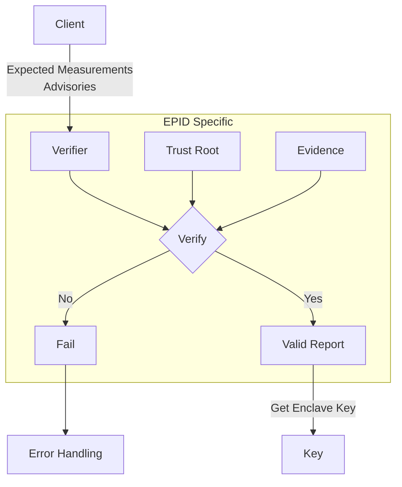
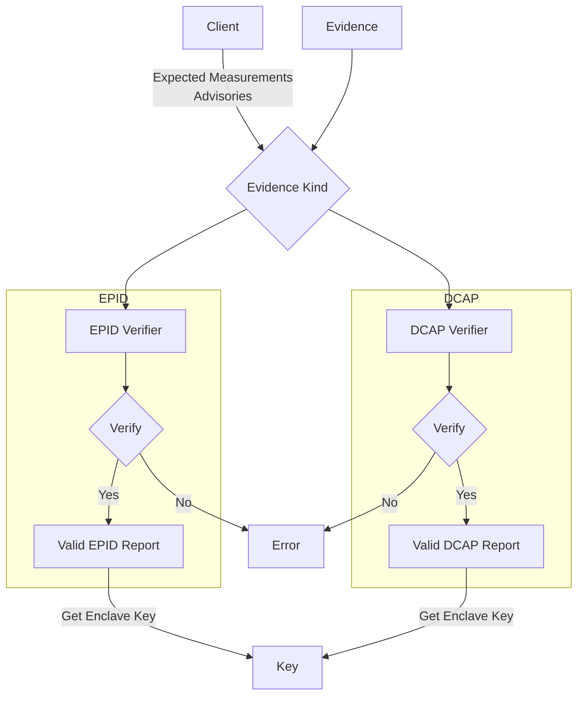

- Feature Name: `dcap_attestation_evidence`
- Start Date: 2023-05-31
- MCIP PR: [mcips #65](https://github.com/mobilecoinfoundation/mcips/pull/65)
- Tracking Issue: [mobilecoin #3119](https://github.com/mobilecoinfoundation/mobilecoin/issues/3119)

# Summary
[summary]: #summary

Support for verifying both EPID and DCAP quotes in the same codebase.

# Motivation
[motivation]: #motivation

We want to provide uninterrupted client support of the MobileCoin services when the services transition from EPID to DCAP attestation.

In order to support this uninterrupted transition, clients will need to have
logic for verifying both the EPID and DCAP flavors of attestation evidence.

# Guide-level explanation
[guide-level-explanation]: #guide-level-explanation

For the current EPID attestation the client provides the expected measurements and advisories to a verifier. The verifier then checks the evidence against the expected measurements and advisories.

A _Measurement_ is either a `MRENCLAVE` value or a `MRSIGNER` value set.

A `MRENCLAVE` value is a hash that uniquely identifies the enclave's code binary. A `MRENCLAVE` measurement is a strict comparison and any change in the enclave's code binary will result in a verification failure.

A `MRSIGNER` is a more lenient verification which allows for newer versions of an enclave's code binary to be used. A `MRSIGNER` value set consists of three values:

1. A hash that uniquely identifies the entity or group that signed the enclave. This is often refered to as the `MRSIGNER` value, not to be confused with the "`MRSIGNER` value set" being described here.
2. The enclave's security version number. This number is incremented when the enclave is updated with security fixes. This is refered to as the ISV SVN. An enclave that has a higher security version number will still pass verification as it is assumed to be more secure than the previous security version.
3. The enclave's product version number. This number varies based on the enclave's purpose. For example fog view has a different product ID than consensus. This is often refered to as the ISV product ID.

Advisories are a list of advisory IDs that an enclave is allowed to have. If there is an advisory ID in the evidence that is not in the allowed list, the verification will fail.

The verifier needs to be able to interpret the evidence and verify that the evidence meets the requirements of the expected measurements and advisories.

The verifier also ensures that the evidence is signed by a trusted party. This signature is provided in an X509 certificate chain that is verified by a trust root.



From the application's perspective, the main difference between EPID and DCAP is the provided `Evidence` format.

Based on the diagram above we should be able to create a similar flow for DCAP. The evidence will differ and will be the deciding factor on which flow to take. We'll propagate the evidence with the client measurements down to the respective verifier.



In order for this to work the client's expected measurements and advisories will need to be formatted the same.

# Reference-level explanation
[reference-level-explanation]: #reference-level-explanation

Currently the client provides the advisories as a list of advisory IDs as either hardening or config advisories.

```rust
mr_enclave_verifier.allow_hardening_advisories(&[
    "INTEL-SA-00334",
    "INTEL-SA-00615",
    "INTEL-SA-00657",
]);
//or
mr_enclave_verifier.allow_config_advisories(&[
    "INTEL-SA-00334",
    "INTEL-SA-00615",
    "INTEL-SA-00657",
]);
```

The DCAP evidence provides the advisories as one of the following:

- UpToDate
- SWHardeningNeeded
- ConfigurationNeeded
- ConfigurationAndSWHardeningNeeded
- OutOfDate
- OutOfDateConfigurationNeeded
- Revoked

Only one of these statuses can be present in the DCAP evidence, which means a client can't specify some advisories to be hardening and others to be config.

At this time there are no known clients using config advisories. Which means we can update the clients to use a format along the lines of:

```rust
let advisories = Advisories::new(
    ["INTEL-SA-00334", "INTEL-SA-00615", "INTEL-SA-00657"],
    AdvisoryStatus::SWHardeningNeeded
);
```

This can then get mapped back to `allow_hardening_advisories()`  for the EPID logic.

The evidence is cached and provided by the enclave hosting applications. This means the enclave hosts have the logic to communicate with EPID or DCAP attestatoin services. The enclave hosting application will will only need to support one of EPID or DCAP.

The code that communicates with the enclave hosting application will need to be updated to support recieving both EPID and DCAP.

# Drawbacks
[drawbacks]: #drawbacks

TBD

# Rationale and alternatives
[rationale-and-alternatives]: #rationale-and-alternatives

TBD

# Prior art
[prior-art]: #prior-art

TBD